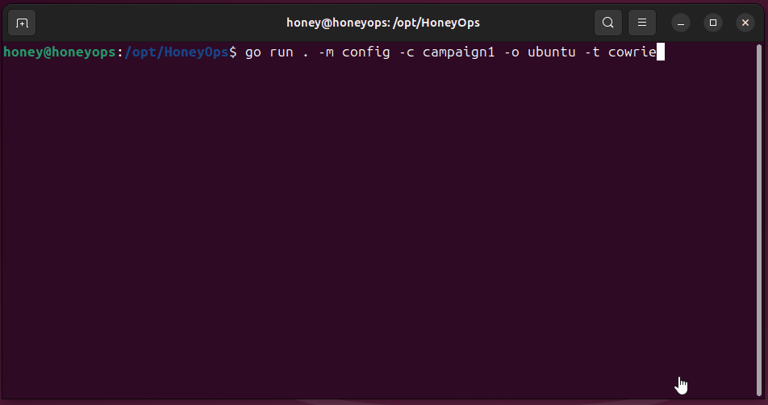
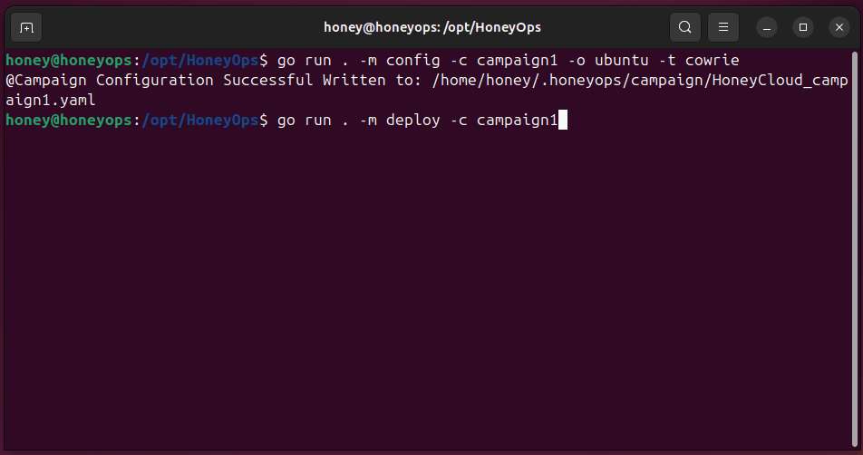
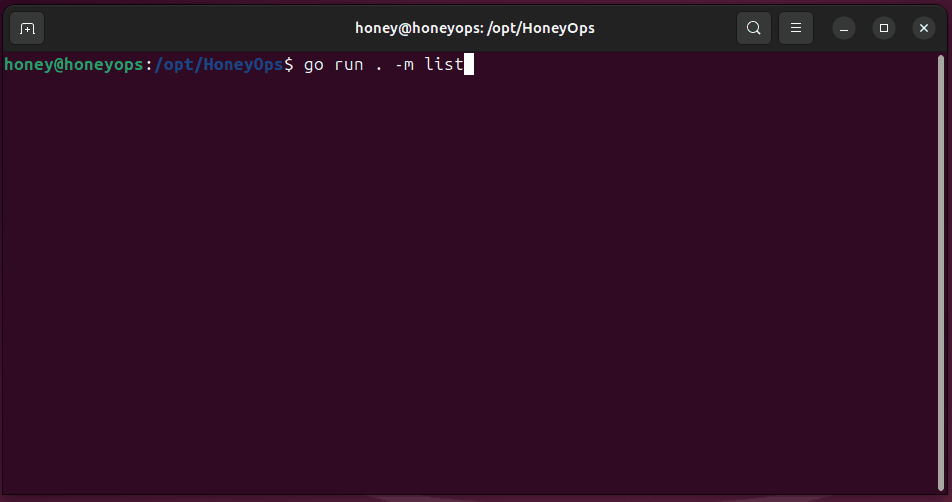
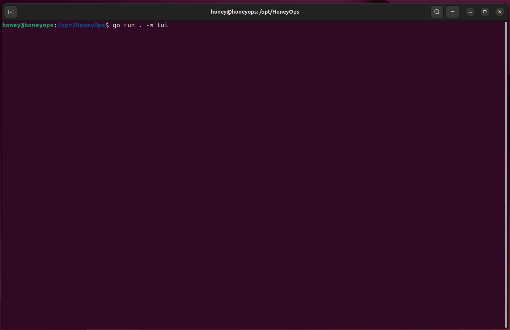

# HoneyOps: From Zero to Honeypot – Interactive Security Made Simple


HoneyOps is a free and easy-to-use tool that allows you to spin up realistic decoy environments, monitor intruder activity in real time, and effortlessly capture valuable threat data, all with a single command. When you're done, you can tear down the entire setup just as quickly, keeping costs low and operations clean. Whether you're a security enthusiast, researcher, or blue teamer, HoneyOps makes it simpler and more affordable than ever to jump into action.

## Contents

- [Operating System Support](#operating-system-support)
- [Prerequisites](#prerequisites)
  - [AWS CLI](#aws-cli)
  - [Pulumi](#aws-cli)
  - [Ansible](#ansible)
  - [Golang](#golang)
- [Installation](#installation)
- [Tutorial](#tutorial)
  - [CLI](#cli)
    - [Create Campaign](#1-init-create-a-new-campaign)
	- [Deploy to Cloud](#2-deploy-configuration-to-the-cloud)
	- [Common Automated Setup](#3-common-setup-choices-within-honeyops)
	- [Listing Campaigns Details](#4-listing-campaign-details)
	- [Firewall Configurations](#5-firewall--security-rules-configurations)
	- [Test Out HoneyPots](#6-testing-out-honeypots)
	- [Ways to Interact with HoneyPot](#7-interacting-with-the-honeypot)
	- [Destroy Cloud Resource](#8-destroying--removing-cloud-resources)
  - [TUI](#text-user-interface-tui)
- [Common Errors](#common-errors-message)
  - [Linux - Pulumi Binary Not Found](#linux---pulumi-binary-not-found)
  - [Linux - Pulumi missing token](#linux---pulumi-missing-token)
  - [Linux - Go binary Not Found](#linux---go-binary-not-found)
  - [Error During HoneyOps Deployment](#honeyops---during-deployment)
	- [Fail-Safe Recovery Method](#fail-safe---recovery)
- [References](#references)
- [Disclaimer](#disclaimer--legal-notice)
- [License](#license)

## Operating System Support


HoneyOps was tested and developed with support for Windows and Ubuntu.  No specific hardware requirements needed. 

## Prerequisites


HoneyOps requires several tools listed under the #Prerequisites section to function properly.

Please ensure the following software are installed before running HoneyOps.

### AWS CLI 


[Amazon Command Line Interface Install Guide](https://docs.aws.amazon.com/cli/latest/userguide/getting-started-install.html)

- Windows

Windows installer can be downloaded from https://awscli.amazonaws.com/AWSCLIV2.msi.
Configure AWS cli with your account's access token.

```
aws configure
```

- Linux

```
curl "https://awscli.amazonaws.com/awscli-exe-linux-x86_64.zip" -o "awscliv2.zip"
unzip awscliv2.zip
sudo ./aws/install
aws configure
```

### Pulumi


[Pulumi Install Guide](https://www.pulumi.com/docs/get-started/download-install/)

- Windows

Windows Install can be downloaded from https://github.com/pulumi/pulumi-winget/releases/download/v3.205.0/pulumi-3.205.0-windows-x64.msi
After install, configure Pulumi to run as offline mode.

```
pulumi login --local
```

- Linux

```
curl -fsSL https://get.pulumi.com | sh
pulumi login --local
```

### Ansible


- Windows (WSL)

Ansible does not have support for Windows. The work around is to install WSL https://learn.microsoft.com/en-us/windows/wsl/install. After installing WSL on Windows, logon to WSL and execute Ansible Linux installation script.

```
powershell> wsl --install
```

- Linux & WSL

Install instructions for specific operating systems https://docs.ansible.com/ansible/latest/installation_guide/installation_distros.html.

```
## Installing Ansible on Ubuntu
sudo apt update
sudo apt install software-properties-common
sudo add-apt-repository --yes --update ppa:ansible/ansible
sudo apt install ansible
```

### Golang


Visit the https://go.dev/doc/install for more details on how to install Golang on your system.


## Installation


Setting up HoneyOps is as easy as cloning this repository and executing **go run . **

## Tutorial


HoneyOps supports two modes of use: a CLI and a TUI. As the tool is still in its early development stage, the CLI currently offers a more stable and reliable experience compared to the TUI interface.

### CLI


Each cloud deployment in HoneyOps is referred to as a “Campaign.”
HoneyOps uses a YAML configuration file for each campaign to keep track of its associated cloud resources. You can run multiple campaigns at the same time, with each one managed by its own YAML file.



#### 1. Init (Create) a new campaign


```
cd HoneyOps
go run . -m config -c campaign_name -o ubuntu -t cowrie
```

 Command Line Options Explained:
 
- `-m config`  
  **m** stands for **mode**. The value `config` is used to configure a new campaign.

- `-c campaign_name`  
  **c** stands for **campaign**. Replace `campaign_name` with your desired name (avoid using special characters).

- `-o`  
  **o** stands for **operating system**. Specifies which OS to deploy on the cloud.  
  - Currently supported: `ubuntu`  
  - Note: Windows support is not fully implemented yet.

- `-t`  
  **t** stands for **tools**. Defines which honeypot tools to install.  
  - Currently supported: `cowrie`, `galah`
  - Enter multiple entries to select multiple tools: -t cowrie -t galah

Campaign YAML files are stored in `.honeyops` directory inside your user’s home folder. Replace `myuser` with your actual username.

- **Windows:**  
  `C:\Users\myuser\.honeyops\campaign`

- **Linux:**  
  `/home/myuser/.honeyops/campaign`

#### 2. Deploy configuration to the cloud




```
go run . -m deploy -c campaign_name
```
 
 Command Line Options Explained:
 
- `-m config`  
  **m** stands for **mode**. The value `deploy` is used to execute Pulumi to deploy cloud resources. Pulumi relies on the AWS CLI for authentication, so please ensure that your AWS access credentials are properly configured on your local machine before proceeding.

- `-c campaign_name`  
  **c** stands for **campaign**. HoneyOps will look for the campaign's YAML file within your home directory.


#### 3. Common setup choices within HoneyOps


HoneyOps modifies the default SSH configuration on all deployed EC2 instances by changing the SSH port from `22` to `65423`.
This is done to free up ports `21` (Telnet) and `22` (SSH) for use by the Cowrie honeypot.

**Firewall (Security Group) Configuration:**  
By default, only your current public IP address is whitelisted. Access is not open to the public unless explicitly configured.

**Ingress Rules:**
- Allow your current IP → TCP/22
- Allow your current IP → TCP/65423

**Egress Rule:**
- Allow all outbound traffic

#### 4. Listing campaign details


After deployment, we can view the campaign's EC2 server names by using the command:

```
go run . -m list
```

HoneyOps displays a menu of options. For now, select option `4` to list the EC2 instance names for the current campaign.



```
go run . -m list
Select components to list:
  1. modes (-m)
  2. tools (-t)
  3. interactions (-a)
  4. campaigns (-c)


Enter index of choice (1,2,3,4):
4

Campaign Name (Undeployed): campaig2
  EC2 Instance Names:
    0-ubuntu()
        Tools: cowrie
        Public Open Firewall Rules (ingress):
            - auto-current/32 (tcp/22)
            - auto-current/32 (tcp/65423)
            - auto-current/32 (tcp/23)
            - auto-current/32 (tcp/80)
            - auto-current/32 (tcp/443)

Campaign Name (Deployed): campaign1
  EC2 Instance Names:
    0-ubuntu(52.221.208.156)
        Tools: cowrie,galah
        Public Open Firewall Rules (ingress):
            - auto-current/32 (tcp/22)
            - auto-current/32 (tcp/65423)
            - auto-current/32 (tcp/23)
            - auto-current/32 (tcp/80)
            - auto-current/32 (tcp/443)
```

#### 5. Firewall / Security Rules Configurations

By default, HoneyOps grants firewall access to the EC2 instances from your current IP address. In order to open public access to the HoneyPot services, it is required to open.

#### Ubuntu

| Port  | Protocol | IP Address      | Used By                                                 |
| ----- | -------- | --------------- | ------------------------------------------------------- |
| 22    | SSH      | Your Current IP | AWS Original SSH Port / Cowrie                          |
| 23    | Telnet   | Your Current IP | Cowrie                                                  |
| 80    | HTTP     | Your Current IP | Galah                                                   |
| 443   | HTTPS    | Your Current IP | Galah                                                   |
| 65423 | SSH      | Your Current IP | HoneyOps relocate original SSH TCP/22 to port TCP/65423 |
#### Windows

| Port | Protocol | IP Address      | Used By                                 |
| ---- | -------- | --------------- | --------------------------------------- |
| 3389 | RDP      | Your Current IP | Connect to RDP                          |
| 445  | SMB      | Your Current IP | Connecting to Windows instance remotely |

#### 6 Testing Out HoneyPots


##### Cowrie

Once deployed, SSH to the honeypot’s IP on port 22 with the `root` account and an arbitrary password to access Cowrie.

```
ssh root@<ec2-ipaddress>
telnet ec2-ipaddress
```
##### Galah

**Note:** The Galah tool should be deployed using the CLI, as it requires an LLM API key to be entered during the setup process. The TUI currently does not support this step and will deploy Galah without the necessary LLM (e.g., ChatGPT) API key. 

https://platform.openai.com/api-keys

Galah is currently configured to use the ChatGPT model by default. Future updates to HoneyOps will include support for additional LLM models.

The following shows example of the prompt to enter API Key.

```
go run . -m deploy -c campaign1
Enter Your LLM API Key: xxxxxxxxxxxxxxxxxxxxxxxxxxxxxxxxxxxxxxxxx
```

Connecting to the EC2 Instance's IP address via the web browser should be sufficient to view it.

- http://ec2-instance-ipaddress
- https://ec2-instance-ipaddress

#### 7. Interacting with the HoneyPot


The following supported interact (-m interact) options (-a action) are available. 

- `-a ssh`  
  Launch an SSH session to the EC2 Ubuntu server. 
  Specify the campaign (-c) and the EC2 instance by name (-i Ec2InstanceName).

```
go run . -m interact -a ssh -c campaign_name -i 0-ubuntu
```

- `-a collectevidence`  
  Save honeypot logs and exploit artifacts to your local machine. Exported evidence files are saved under `~/.honeypots/LogsExport`. 
  Specify the campaign (-c) and the EC2 instance by name (-i Ec2InstanceName).

```
go run . -m interact -a collectevidence -c campaign_name -i 0-ubuntu
```

- `-a cowrie:randomize` (experiential at the moment)
  Randomize Cowrie's environment, users, banners, system files, and more to make the honeypot harder for intruders to detect. Keeping it fresh.
  Specify the campaign (-c) and the EC2 instance by name (-i Ec2InstanceName).

```
go run . -m interact -a cowrie:randomize -c campaign_name -i 0-ubuntu
```

- `-a cowrie:watchlogs`  
  Monitor Cowrie intruder activity in real time.
  Specify the campaign (-c) and the EC2 instance by name (-i Ec2InstanceName).

```
go run . -m interact -a cowrie:watchlogs -c campaign_name -i 0-ubuntu
```

- `-a galah:watchlogs`  
  Monitor Galah visitor activity in real time.
  Specify the campaign (-c) and the EC2 instance by name (-i Ec2InstanceName).

```
go run . -m interact -a galah:watchlogs -c campaign_name -i 0-ubuntu
```

- `-a report`  
  Generate Markdown reports for both Cowrie and Galah, providing quick access to statistics on intruder activity.
  Specify the campaign (-c) and the EC2 instance by name (-i Ec2InstanceName).

```
go run . -m interact -a report -c campaign_name -i 0-ubuntu
```

- `-a openfirewall`  
  Add an ingress rule to allow public internet access to the honeypot.
  Specify the campaign (-c) and the EC2 instance by name (-i Ec2InstanceName).
  Specify addition arguments to define which protocol and port to open. (-n tcp/80)

```
go run . -m interact -c campaign_name -i 0-ubuntu -a openfirewall -n tcp/80
go run . -m deploy -c campaign_name
```

- `-a closefirewall`  
  Remove the ingress rule to block public internet access to the honeypot.
  Specify the campaign (-c) and the EC2 instance by name (-i Ec2InstanceName).
  Specify addition arguments to define which protocol and port to close. (-n tcp/80)

```
go run . -m interact -c campaign_name -i 0-ubuntu -a closefirewall -n tcp/80
go run . -m deploy -c campaign_name
```

- `-a yara:gitclonerulesfrom`  
  Download Yara rules repository into `/opt/yara/rules` directory where the monitoring script will automatically pickup and use to scan for new samples.
  Specify the campaign (-c) and the EC2 instance by name (-i Ec2InstanceName).
  Specify git repository URL using (-n https://....../yararules.git).

A sample collection of Yara rules has been uploaded to https://github.com/PastelOps/HoneyOps-Yara-Rules-Collection. Executing the following command will download the repo to the EC2 instance's Yara rules folder `/opt/yara/rules`. 

```
go run . -m interact -c campaign_name -i 0-ubuntu -a yara:gitclonerulesfrom -n https://github.com/PastelOps/HoneyOps-Yara-Rules-Collection
```

- `-a rdp`  
  Launch an RDP session to the EC2 Windows server (experimental).
  Specify the campaign (-c) and the EC2 instance by name (-i Ec2InstanceName).

```
go run . -m interact -a rdp -c campaign_name -i 0-windows
```


#### 8. Destroying / Removing Cloud Resources


When you're finished, you can tear down the cloud resources by running the following command. This will remove all deployed assets and help prevent any additional costs.

```
go run . -m destroy -c campaign_name
```

### Text User Interface (TUI)


The TUI is still under development and currently offers partial support for configuration, deployment, and destruction of campaigns. It also includes functionality to initiate SSH sessions with the EC2 instance.

**Known Bugs** 
- Galah deployment is currently best performed via the CLI, as HoneyOps will prompt you to enter your LLM API key during installation. This approach ensures that the key is not stored locally within HoneyOps. Instead, the key is used only during setup on the EC2 instance and is accessible exclusively to the root or galah user. At this time, the TUI does not support entering the LLM API key, and as a result, deployments through the TUI will fail.
- The table does not refresh quickly due to the slow read speed of campaign configurations. 

To access the TUI, enter the following command:

```
go run . -m tui
```



Instructions are displayed on screen to guide you.
## YARA Scanner Support

HoneyOps installs YARA monitoring scripts to monitor the files uploaded and downloaded by intruders on Cowrie HoneyPot.

### Monitored Directory - Cowrie

Cowrie automatically saves files retrieved by attackers in the `/opt/cowrie/cowrie/var/lib/cowrie/downloads` directory. A curated collection of YARA rules from various sources has been consolidated into a dedicated repository. The deployment script currently includes a single YARA rule as a demonstration for the monitoring process.

### Add YARA rules to the monitoring process

By using the command `-m interact -a yara:gitclonerulesfrom`, you can import new YARA rules into the EC2 instance. This is done by hosting the rules in a publicly accessible Git repository, which the tool will clone directly into the `/opt/yara/rules` directory. Once added, the rules are automatically detected and incorporated into the monitoring process.

```
go run . -m interact -c campaign_name -i 0-ubuntu -a yara:gitclonerulesfrom -n https://github.com/POMelvin/HoneyOps-Yara-Rules-Collection.git
```

## Common Errors Message

### Linux - Pulumi binary Not Found

Error Message 

```
> go run . -m destroy -c campaign_name
Failed to create or select stack: failed to create stack: failed to run `pulumi version`: exec: "pulumi": executable file not found in $PATH
```

Resolution

Ensure Pulumi is installed for the current Linux user. If installed, the pulumi executable should be saved into ~/.pulumi/bin/pulumi path.

```
export PATH=$PATH:~/.pulumi/bin/
```

### Linux - Pulumi missing token

Error Message

```
go run . -m destroy -c campaign_name
Failed to create or select stack: failed to select stack: exit status 255
code: 255
stdout: 
stderr: error: PULUMI_ACCESS_TOKEN must be set for login during non-interactive CLI sessions
```

Resolution

Pulumi by default will connect with cloud service. For HoneyOps currently only supports local mode. Therefore, run the following command to use pulumi in local mode.

```
pulumi login --local
```

### Linux - Go binary Not Found

Error Message

```
go run . -m destroy -c cli
Command 'go' not found, but can be installed with:
snap install go         # version 1.25.3, or
apt  install golang-go  # version 2:1.21~2
apt  install gccgo-go   # version 2:1.21~2
See 'snap info go' for additional versions.
```

Resolution

Add /usr/local/go/bin to the `PATH` environment variable.

You can do this by adding the following line to your $HOME/.profile or /etc/profile (for a system-wide installation):

```
export PATH=$PATH:/usr/local/go/bin
```


### HoneyOps - During Deployment

Pulumi Fully Qualified Name Error

The following error may apply when the "~/.honeyops/pulumi/Pulumi.yaml" is not present. Check if this file is present in your local home directory. If not, copy the sample "Pulumi.yaml" from the sample folder.

```
error: no Pulumi project found in the current working directory. If you're using the `--stack` flag, make sure to pass the fully qualified name (org/project/stack)
```

Unable to locate Ansible-Playbooks

The Ansible playbooks are stored in the "automation" directory, located in the same directory as HoneyOps's main.go file. For proper execution, HoneyOps should be run from the root of the source code, as the current implementation relies on relative paths to access the Ansible playbooks from that location.

```
05/11/2025  03:25 pm    <DIR>          .
05/11/2025  09:15 pm    <DIR>          ..
06/11/2025  02:59 pm    <DIR>          automation
20/10/2025  01:01 am    <DIR>          cloud
21/10/2025  05:55 pm    <DIR>          common
03/11/2025  11:09 pm             6,588 go.mod
03/11/2025  11:09 pm            62,506 go.sum
05/11/2025  02:27 pm             9,980 main.go
31/10/2025  11:46 pm    <DIR>          Prebuilt-Go-Binary
```

### Fail Safe - Recovery

Just in case, any of the scripting fails which may result in a unsync envirnment between HoneyOps local configuration and your AWS cloud resources. All changes on the cloud is handled by pulumi under the hood and it's main pulumi yaml congiurations and state are stored in ~/.honeyops/pulumi folder.

In case a desync happens, and you need to remove the resource from AWS. Execute the following commands to force cancel or delete the deployment.

To list stack (campaigns) managed by pulumi:

```
~/$ cd ~/.honeyops/pulumi

~/.honeyops/pulumi$ pulumi stack ls
NAME        LAST UPDATE    RESOURCE COUNT
campaign1*  4 minutes ago  21
```

The default password set by HoneyOps for pulumi offline mode is:

```
DefaultChangeThis
```

Execute the following to cancel any existing pulumi deployment for the stack and remove all  resources from the Cloud.
```
~/.honeyops/pulumi$ pulumi cancel & pulumi down
[1] 21982
This will irreversibly cancel the currently running update for 'campaign1'!
Please confirm that this is what you'd like to do by typing `campaign1`: Enter your passphrase to unlock config/secrets
    (set PULUMI_CONFIG_PASSPHRASE or PULUMI_CONFIG_PASSPHRASE_FILE to remember): [Enter HoneyOps Default Pulumi Password Here]
    
Enter your passphrase to unlock config/secrets
Previewing destroy (campaign1):
     Type                                 Name                                                Plan       
 -   pulumi:pulumi:Stack                  honeyops-campaign1                                  delete     
 -   ├─ command:local:Command             campaign1-0-ubuntu-playAnsibleCowrie-Linux          delete     
 -   ├─ command:remote:Command            campaign1-0-ubuntu-installAnsibleAndMoveSSHPortCmd  delete     
 -   ├─ aws:vpc:SecurityGroupIngressRule  0-campaign1-ubuntu-allow-ssh-22-auto-current        delete     
 -   ├─ aws:ec2:Instance                  0-ubuntu                                            delete     
 -   ├─ aws:vpc:SecurityGroupEgressRule   0-campaign1-ubuntu-allow-all-traffic                delete     
 -   ├─ command:local:Command             campaign1-0-ubuntu-playAnsibleYaraMonitoring-Linux  delete     
 -   ├─ command:remote:Command            campaign1-0-ubuntu-installYaraCmd                   delete     
 -   ├─ aws:vpc:SecurityGroupIngressRule  0-campaign1-ubuntu-allow-ssh-65423-auto-current     delete     
 -   ├─ aws:ec2:Route                     campaign1-inet-route                                delete     
 -   ├─ aws:ec2:Subnet                    campaign1-priv-subnet-1                             delete     
 -   ├─ aws:ec2:SecurityGroup             0-campaign1-ubuntu-public-sg                        delete     
 -   ├─ aws:ec2:Subnet                    campaign1-pub-subnet-0                              delete     
 -   ├─ aws:ec2:DefaultRouteTable         campaign1-vpc                                       delete     
 -   ├─ tls:index:PrivateKey              ec2-ssh-key                                         delete     
 -   ├─ aws:ec2:KeyPair                   ec2-key-pair                                        delete     
 -   ├─ aws:ec2:InternetGateway           campaign1-inet-gw                                   delete     
 -   └─ aws:ec2:Vpc                       campaign1-vpc                                       delete     

Outputs:
  - 0-ubuntu                 : "x.x.x.x"
  - EC2-PrivKeyPath-campaign1: "/home/honey/.honeyops/privatekeys/Ec2SshKey_campaign1.ppk"

Resources:
    - 18 to delete

Do you want to perform this destroy?  [Use arrows to move, type to filter]
  yes
> no
  details

```

## References

- Cowrie: https://github.com/cowrie/cowrie
- Galah: https://github.com/0x4D31/galah
- Pulumi: https://github.com/pulumi/pulumi
- Viper: https://github.com/spf13/viper
- Bubbletea: https://github.com/charmbracelet/bubbletea
- Go-Gota: https://github.com/go-gota/gota/

## Disclaimer / Legal Notice

HoneyOps is use for **educational and research purposes only**.  
They are intended to support learning and security testing within **authorized environments**.  

- Do **not** use these tools against applications, systems, or devices without **explicit permission**.  
- Unauthorized use may violate local, state, or international laws.  
- The authors and contributors take **no responsibility** for any misuse or damage caused by the use of these materials.  

By using the contents of this repository, you agree to take full responsibility for your actions and to comply with all applicable laws and regulations.  

## License

This repository is released under the [MIT License](https://opensource.org/licenses/MIT).  

You are free to use, copy, modify, merge, publish, distribute, sublicense, and/or sell copies of the software, provided that the original copyright notice and this permission notice are included in all copies or substantial portions of the software.  

The software is provided **"as is"**, without warranty of any kind, express or implied, including but not limited to the warranties of merchantability, fitness for a particular purpose, and noninfringement. In no event shall the authors or copyright holders be liable for any claim, damages, or other liability, whether in an action of contract, tort, or otherwise, arising from, out of, or in connection with the software or the use or other dealings in the software.  
